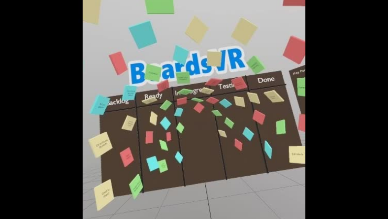
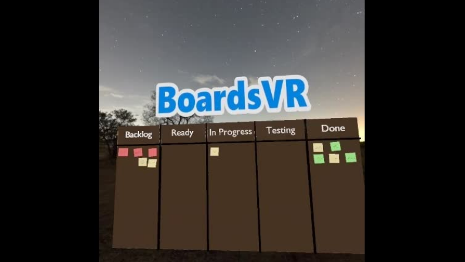

# BoardsVR
Project created using StereoKit for the Mixed Reality Dev Days 2022 - Microsoft Hackathon. Created in Visual Studio, deployed and ran on Oculus Quest 2.

## Technology
C#, StereoKit mixed reality library.

## Microsoft Mixed Reality Hackathon
[Microsoft Mixed Reality Hackathon](https://devdays.devpost.com/)

## Hackathon project on DevPost
[BoardsVR project on DevPost](https://devpost.com/software/boardsvr)

## Images

